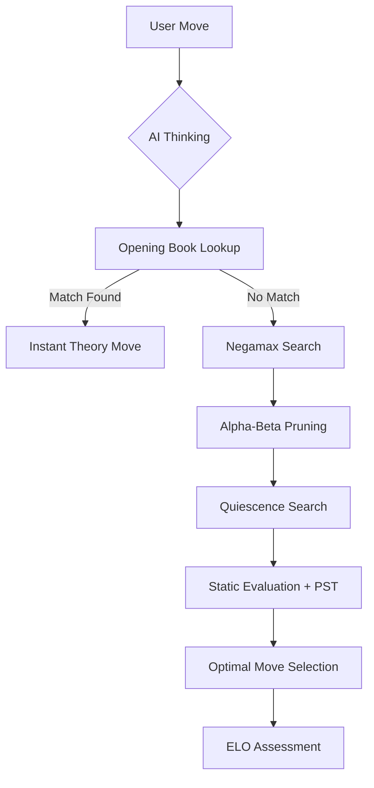
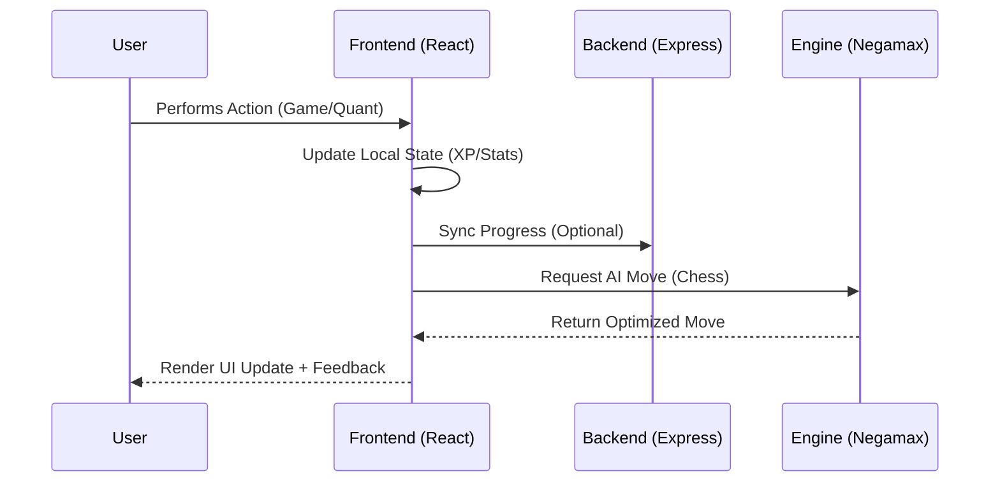

# 🧠 GREnius: The Cognitive Blueprint

[](https://reactjs.org/)
[](https://www.typescriptlang.org/)
[](https://tailwindcss.com/)
[](https://vitejs.dev/)
[](https://expressjs.com/)

> **A premium, high-performance cognitive training platform engineered for GRE aspirants and chess enthusiasts. Built with a focus on algorithmic precision and architectural elegance.**

---

## 🏗️ Problem vs. Solution

| The Problem | The GREnius Solution |
| :--- | :--- |
| **Cognitive Fatigue** | Dynamic, game-based learning modules that maintain high engagement through gamification. |
| **Static Learning** | Algorithmic difficulty scaling that adapts to the user's performance in real-time. |
| **Fragmented Prep** | A unified ecosystem combining GRE Quantitative practice with advanced strategic training (Chess). |
| **Lack of Assessment** | Deep-dive post-game analysis and ELO-based performance tracking. |

---

## 🧠 Intelligence & Architecture

GREnius is built on a **Full-Stack Blueprint** utilizing a custom Express server with Vite middleware integration for seamless development and production-grade performance.

### ♟️ Chess Engine: "The Grandmaster Algorithm"
The core engine utilizes a **Negamax search with Alpha-Beta pruning** and **Quiescence Search** to eliminate the horizon effect.



### 📊 System Flow



---

## 🚀 Primary Features

### 1. **Advanced Chess Suite**
- **Difficulty Scaling**: Three distinct tiers (600, 1200, 1800+ ELO).
- **Opening Book**: Integrated theory for Sicilian, Ruy Lopez, and Queen's Gambit.
- **Post-Game Analysis**: Interactive accuracy summary with "Show me how" correction logic.

### 2. **GRE Quantitative Mastery**
- **250+ High-Difficulty Questions**: Covering Geometry, Algebra, and Data Interpretation.
- **Question Types**: Quantitative Comparison (QC), Multiple Choice (MC), and Numeric Entry (NE).

### 3. **Cognitive Game Modules**
- **Mental Math**: Stress-based arithmetic challenges.
- **Memory Palace**: Grid-based visual pattern recognition.
- **Speed Blitz**: Rapid-fire vocabulary and logic puzzles.

---

## 🛠️ Setup & Installation

### Prerequisites
- **Node.js**: v18.0.0 or higher
- **npm**: v9.0.0 or higher

### Installation

1. **Clone the Blueprint**
   ```bash
   git clone https://github.com/rahulcvwebsitehosting/grenius.git
   cd grenius
   ```

2. **Install Dependencies**
   ```bash
   npm install
   ```

3. **Launch Development Environment**
   ```bash
   npm run dev
   ```

4. **Build for Production**
   ```bash
   npm run build
   ```

---

## 🎨 UI Layout Blueprint

| Component | Description | Visual Mood |
| :--- | :--- | :--- |
| **Dashboard** | Central hub for all cognitive modules and XP tracking. | Minimalist, High-Contrast |
| **Chess Arena** | Professional-grade board with material advantage indicators. | Classic, Strategic |
| **Quant Lab** | Focused environment for GRE question sets. | Academic, Clean |
| **Analysis Modal** | Deep-dive metrics and Mermaid-style performance charts. | Data-Driven, Dark Mode |

---

## 🤝 Connect

Developed with ❤️ by **Rahul Shyam**. Let's build the future of cognitive technology together.

[](https://linkedin.com/in/rahulshyamcivil)
[](https://github.com/rahulcvwebsitehosting)

---

<p align="center">
  <i>"Precision in every move, intelligence in every line."</i><br>
  © 2026 GREnius Cognitive Systems. All rights reserved.
</p>
